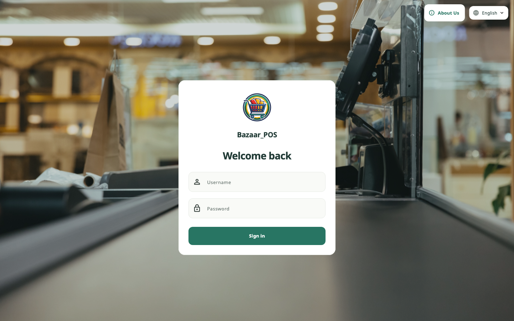
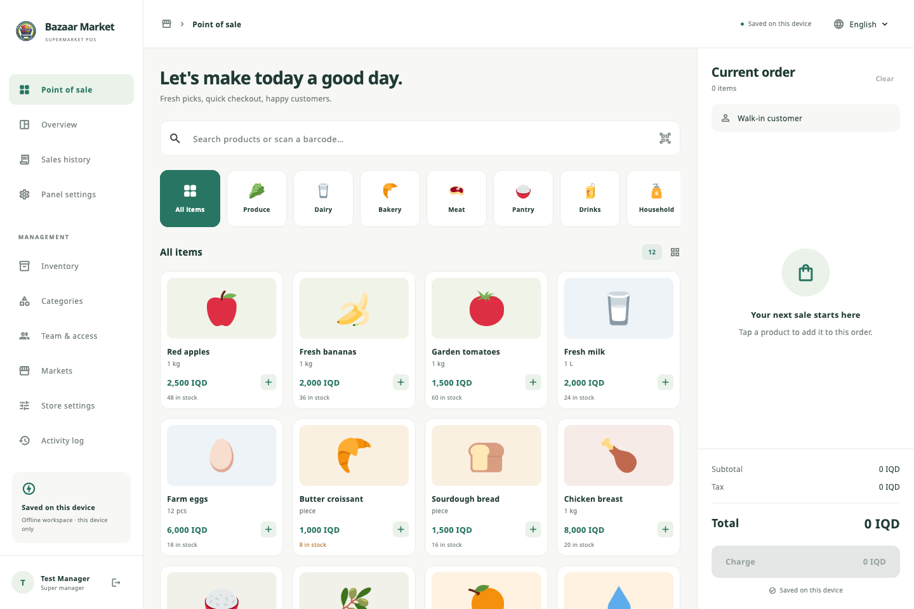

# Bazaar_POS

A Flutter supermarket point of sale for **iOS, Android, macOS and Windows**, with an additional **localhost browser preview**. Each installation has independent offline data.

## Open the local preview

While the preview server is running, open **http://localhost:8080**. Use this same address and browser profile each time; `127.0.0.1`, another port, or another profile has separate browser storage.

To build and start it again:

```sh
./tool/serve.sh
```

In VS Code, select **Bazaar_POS (localhost:8080)** in Run and Debug for a
development session at the same address. Stop the preview server before using
that launch configuration so port 8080 is available.

To make the app available at an internet address, follow the
[website publishing and GitHub release guide](docs/publishing.md).

The welcome screen shows the Bazaar_POS branding, language selector, an **About Us** button in the top corner, and the username/password sign-in form. Enter username **`safin97`** and the password supplied by the store owner, then select **Sign in**. This account has **super manager** access. The password is not printed in this README or stored as plaintext in the app.

A one-time migration provisions this account for both fresh installations and existing local databases. Existing inventory, sales, branding and other staff accounts are retained. Subsequent starts respect account edits and password changes rather than resetting them. New installations include editable sample inventory with no fabricated sales. Store details and team accounts are managed after signing in.

Open only one tab per browser profile. The browser preview holds an exclusive Web Lock to avoid conflicting edits. Browser data is stored in IndexedDB and can be removed by clearing site data. It is a development preview: browser writes use SQLite's asynchronous IndexedDB cache, so the native app provides stronger durability guarantees. The local server must remain running to reload the browser app.

## Included workflows

- Responsive login-only welcome screen; desktop sidebar and mobile drawer.
- English, Arabic, and **Kurdish Badini in Arabic script**, with RTL layout, persistent language selection and bundled Noto fonts.
- Product search, category filtering, barcode entry, cart quantities, cash checkout, change calculation, and external card terminal payment recording.
- Inventory and category creation, editing and deletion; translated names, local photos and selectable icons, barcodes unique within each market, unit labels, costs, prices, stock counts and low-stock alerts.
- Staff creation, editing, password reset, account enable/disable and deletion, with permissions enforced in the data layer.
- Sales history, date filters, receipt reprinting, CSV export, seven-day sales chart, gross profit, item counts, seller/item breakdowns and stock alerts. Voided receipts are excluded from report totals.
- Manager sale voiding with a mandatory reason, exactly-once stock restoration for existing catalog items, and a retained receipt/audit history.
- Super admins and each market’s admin can edit its store name, logo, tagline, contact details, tax rate, receipt header/footer, cashier visibility and 58/80 mm receipt width. Saved receipts retain their market details, custom logo, seller, line costs and totals.
- PDF receipt generation and OS print dialogs using bundled fonts, without downloading fonts at runtime.
- Independent markets on the same device, each with its own categories, products, staff, sales, branding and audit log. Existing data migrates into the original market without resetting it.
- USD (US dollar), IQD and EUR as per-market currencies; dollar amounts display with a dollar sign and cents.
- Local SQLite transactions, an audit log, salted PBKDF2 password hashes and short sign-in throttling.

## UI previews





## Set up two markets and admins

1. Sign in as `safin97`, open **Markets**, and choose **Add market**. Enter its name, optionally upload its logo, and choose USD, IQD or EUR as its **Main currency**. For USD/IQD markets, optionally turn on **Display USD and IQD** and enter your rate as IQD for 1 USD.
2. **Manage market** selects that market and opens **Settings**. Edit its logo, name, address, phone, receipt details and optional display rate, then save.
3. Open **Team** and add an **Admin**, **Market owner** or **Cashier** account. When the super admin selects the **Admin** role for a new account, a **Market** dropdown lets them assign any existing market; owners and cashiers use the current market. Under **Market logo & background**, optionally upload and preview a logo and background for that market. The images and account save together; leaving the images alone preserves existing branding. The super admin can also change or remove them when editing an admin. Usernames are unique across this device so the login form stays username/password only.
4. Repeat for another market. Admins and staff are assigned to their market when created; they enter that market automatically at login. Only the super admin can switch markets or create another market.

The welcome screen displays a market's logo and background when an active team member enters their username. Empty or unrecognized usernames and the super manager use the default app artwork. The title stays **Bazaar_POS**. Market logos also appear in navigation and receipts; background images are saved once per market and included in backups, without duplicating them into receipts.
5. Each admin can use **Categories** to add/edit category names, photos and icons, and **Inventory** to add products and their photos/icons. A category containing products cannot be deleted until those products are reassigned or removed.

Choose the main currency before adding inventory or making sales. It is fixed after that so existing prices and receipts are not reinterpreted. Optional USD/IQD display adds an approximate second price in the register and inventory, and a reference total at checkout and on receipts. Enter the exchange rate yourself; it is not downloaded automatically. Payments, change, stored prices, costs, reports and CSV exports use the main currency. Each receipt keeps the display rate used when it was issued, so changing a rate later does not change old receipts.

A market owner opens **Overview** with revenue, gross profit, receipt count and item count. Select a date period and expand **Sales by staff** to see each seller’s items and receipts. **Sales history** supports search, PDF receipt printing/saving and CSV export including market, item count, cost and gross profit. Gross profit subtracts item costs and discounts and excludes tax; it does not include rent, wages or other operating expenses.

## Role permissions

| Action | Cashier | Admin | Market owner | Super admin |
| --- | --- | --- | --- | --- |
| Checkout | Yes | Yes | — | Yes |
| Own receipts and receipt reprint | Yes | Yes | Yes | Yes |
| All market sales, profit, seller reports and CSV | — | Yes | Yes | Yes |
| Products, categories, photos, icons and stock | — | Yes | — | Yes |
| Discount and void a sale | — | Yes | — | Yes |
| Add/edit/delete cashier accounts | — | Yes | — | Yes |
| Add/edit/delete admin and owner accounts | — | — | — | Yes |
| Market branding, receipts and audit log | — | Yes | — | Yes |
| Create or switch markets | — | — | — | Yes |
| Create or restore a complete-device backup | — | — | — | Yes |

Permissions apply only within the account’s assigned market. When adding or editing a **Cashier** in **Team & access**, admins and super admins can select **Extra permissions**: all-market sales/profit reports and CSV export; inventory/category management (including prices, costs and photos); checkout discounts; and sale voiding/restocking. All are off by default. Voiding applies only to visible receipts: grant reporting access too to include other sellers’ receipts. These options never grant staff management, market switching or branding access.

A market owner is a read-only reporting role. Super manager accounts are hidden from Team & access for every role, and the super manager role is omitted from its role summaries and account editor. Accounts cannot delete/disable themselves or change their own role. Admins cannot promote users or edit another admin, owner or super admin. Switching markets clears the unsaved register cart and open forms. Posted transactions are retained; **Void & restock** reverses a sale without deleting its receipt history. Staff/product deletion retains historical receipt snapshots.

## Run native apps

Requires Flutter 3.47+ / Dart 3.13+. Dependencies are pinned in `pubspec.lock`.

```sh
flutter pub get
flutter devices
flutter run -d macos
flutter run -d windows  # on a Windows host
flutter run -d <ios-or-android-device-id>
```

Build commands:

```sh
flutter build apk --release
flutter build appbundle --release
flutter build ios --release --no-codesign
flutter build macos --release
flutter build windows --release
```

- **Android:** install Android Studio/SDK, accept SDK licenses, configure your signing key for release distribution.
- **iOS/macOS:** install full Xcode and run its first-launch setup. Plugin builds may also need CocoaPods. iOS device distribution needs your Apple signing team and provisioning.
- **Windows:** build on Windows with Visual Studio's Desktop development with C++ workload.
- macOS sandbox entitlements include user-selected file access and printing.
- Editable in-app branding changes the market navigation, receipts and welcome artwork. The welcome screen keeps the Bazaar_POS app name. OS launcher names/icons are build-time assets; changing those requires rebuilding the app.

On the development Mac used to create this project, the Android SDK, full Xcode and CocoaPods were unavailable. Native binaries could not be verified there. The web release build and Flutter tests can be verified without these platform SDKs.

## Validation

```sh
flutter analyze
flutter test
# Browser storage, startup, authentication and checkout regression tests:
# Install Chrome, or set CHROME_EXECUTABLE to a Chrome/headless-shell binary.
./tool/test_web.sh
# Optional visual preview capture (writes docs/previews/*.png):
flutter test test/layout_test.dart --dart-define=CAPTURE_PREVIEWS=true
```

Browser tests exercise the real SQLite WASM/IndexedDB adapter and confirm the login screen appears. They also cover ID generation, staff creation, login, checkout, USD receipts, category/photo persistence within a sale, market separation and owner access in JavaScript.

Tests cover login-only UI, administrator provisioning, one-time account migration, authentication, role permissions, market isolation, legacy migration, separate branding/receipt snapshots, category and photo persistence, stock/payment validation, tax/discount rounding, transaction rollback, voiding, restart persistence, translations, responsive layouts, catalog editing, owner reports and multilingual PDF generation.

## Data and operating boundaries

Native data is stored in `Bazaar_POS.sqlite` in the platform application-support directory. SQLite commits the stock updates, receipt and audit record in one transaction. Money uses integer hundredths, and tax rounds once on the discounted order subtotal. Quantities are **whole packs/units**; weighted quantities and scales are not implemented. Currency is fixed once inventory or sales exist so reports never mix denominations. Initial sample prices are illustrative.

The data layer lives in `lib/data/pos_store.dart`; platform storage adapters are in `lib/data/database_native.dart` and `database_web.dart`. Markets, categories, products, staff and sales have persistent market identifiers, and mutations validate the active market and role. Records have separate SQLite tables with JSON payloads. The UI keeps a local in-memory view of these tables; very large catalogs/ledgers would benefit from query pagination and background database work.

Role checks protect normal application workflows. A person with filesystem or browser developer-tool access can inspect or alter this local, unencrypted database; use OS account/device protection for a live checkout station. There is no cloud synchronization, remote account recovery, payment processor connection, automatic backup, camera scanner, cash-drawer driver, or direct Bluetooth/USB ESC/POS integration. Keyboard-style barcode scanners work through the search field (send Enter). Card payments must be completed on a separate terminal. Voiding a recorded sale does not send a monetary refund.

Badini translations are provided in `lib/core/strings.dart`; have a native Badini speaker review business terminology before rollout. Flutter's system Material calendar/picker controls use Arabic when Badini is selected; application labels and RTL layout use Badini. Product names can be edited independently in all three languages.

## References and asset licenses

- [Flutter platform setup](https://docs.flutter.dev/platform-integration)
- [Flutter internationalization](https://docs.flutter.dev/ui/internationalization)
- [SQLite package and native/web support](https://pub.dev/packages/sqlite3)
- [Printing package](https://pub.dev/packages/printing)
- [SQLite web runtime release](https://github.com/simolus3/sqlite3.dart/releases/tag/sqlite3-3.5.2)
- Noto font licenses are included at `assets/fonts/LICENSE.txt`.

Product illustrations: Twemoji graphics by Twitter, Inc. and other contributors, licensed under [CC BY 4.0](https://creativecommons.org/licenses/by/4.0/), from [Twemoji v16.0.1](https://github.com/jdecked/twemoji/tree/v16.0.1). The bundled images are unchanged; the full license is in `assets/products/LICENSE-GRAPHICS`.

The default app logo and launcher icons use the colorful shopping cart image supplied by the store owner, originally named `vecteezy_colorful-shopping-cart-logo-with-green-yellow-and-red-stripes_46624660.jpg`. The bundled copy is `assets/branding/shop-logo.png`; native and web icon assets are resized from that same supplied artwork. The welcome screen uses this logo until a team member enters a username with custom market branding. After sign-in, a custom logo takes precedence for the market's screens and receipts.

The welcome screen background uses the store owner's supplied `empty-cashier-work-place.jpg`, resized and bundled as `assets/branding/welcome-background.jpg` for offline use.

## Backups

The super manager can open **Settings → Backups** to save or restore all markets
on this device. Optional Google Drive backups use Google account sign-in on web
and desktop, after the app owner configures a Google OAuth client. See
[backup usage and Google Drive setup](docs/google-drive-backups.md).

## GitHub updates

Open **Panel settings → App updates → Check GitHub for updates**. The app checks
`safin97/Bazaar_POS` for the latest published stable GitHub release, compares it
with the running app version, and shows the release notes. **Download update**
opens the matching package in the device's browser. Open the downloaded installer
to finish updating; downloading alone does not replace the running app. Finish
sales and save edits before installing or reloading. The updater does not change
market data or run Git commands.

The update API uses public releases without an embedded token. A private
repository or a repository with no published release displays a clear message;
**GitHub releases** still opens the repository in your browser, where you can
sign in if needed. For private source code, publish your distributable packages
to a separate public release repository and build with
`--dart-define=GITHUB_REPOSITORY=owner/release-repository`. Never embed a GitHub
access token in the client app.

To publish an update:

1. Increase `version:` in `pubspec.yaml`, for example to `1.0.2+3`. Keep the
   development defaults in `lib/core/updates/app_updates.dart` in sync (a test
   catches mismatches). Native builds read their installed package version;
   `tool/build_web.sh` embeds the version from `pubspec.yaml` into the web code.
2. Build and test the release for your target devices using the build commands
   above. Native installers need the same application identity and signing key
   as the installed app for an in-place upgrade. Package desktop applications
   with their complete runtime files. Use the exact asset names below; each
   package must support the architectures used by your store's devices.
3. Create a **published, non-prerelease GitHub release** tagged `v1.0.2+3` (or
   `v1.0.2`) and attach the packages. Add installation instructions to its notes.
   Numeric `+build` tags also support an update to the same version with a higher
   build number. Four-part tags such as `v1.0.2.3` are also accepted as
   `1.0.2+3`; the fourth number is the build number. An ordinary Git push or tag
   without a published release does
   not create an app update.

| Device | Recognized GitHub release asset names, in preference order |
| --- | --- |
| Android | `Bazaar_POS-android.apk` |
| macOS | `Bazaar_POS-macos.dmg`, `Bazaar_POS-macos.zip`, `Bazaar.POS.app.zip` |
| Windows | `Bazaar_POS-windows.exe`, `Bazaar_POS-windows.msix`, `Bazaar_POS-windows.zip` |
| Linux (if you add a Linux build target) | `Bazaar_POS-linux.AppImage`, `Bazaar_POS-linux.tar.gz` |
| Browser | `Bazaar_POS-web.zip` |
| iOS | Release notes link to your signed App Store/TestFlight distribution |

If there is no matching package, the app offers the release page and installation
instructions. Source archives are not offered as app installers.

For a web release, run `bash tool/build_web.sh` (also used by `tool/serve.sh`),
then ZIP the **contents** of `build/web` as `Bazaar_POS-web.zip`. The script embeds
a build ID and includes `app-update.json`. The store owner installs the downloaded
web package on the existing server; **Check this server → Load update** then
confirms a reload. A browser cannot replace the files on its host server. Keep
the same address, port, and browser profile so saved market data remains available.
The build script accepts Flutter build arguments, including `--base-href` and the
repository override above. No release is published automatically by these scripts.

Updater regression checks: `flutter test test/github_updates_test.dart test/panel_updates_test.dart`.
The GitHub request format follows the [GitHub Releases API](https://docs.github.com/en/rest/releases/releases#get-the-latest-release).
# Bazaar_POS
